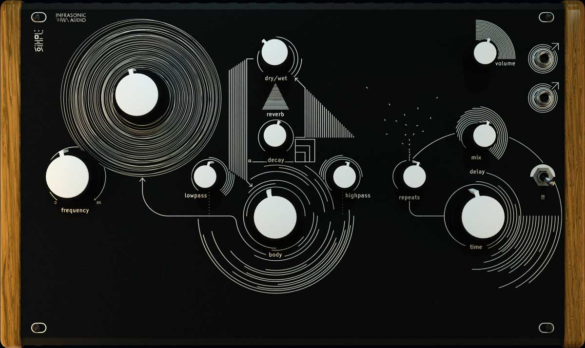

# Audrey II

Audrey II is a droning horroscape generator instrument for the Daisy Seed + SynthUX Simple platform
based on simple physical modeling principles.

_The vortex beckons you. With trembling fingers, you ever so gently turn the mysterious knob within.
Gently, at first, the engine stirs and the arcane beast within awakens. Your pulse quickens.
It wants more. As you turn the knob further, a chilling draft fills the room. The tone swells.
You attempt to appease it with the other controls, but its cries merely evolve into something new,
 equally terrifying and beautiful. A tear rolls down your cheek. The prophecy is fulfilled._

## Overview

At the core of Audrey II is a [Karplus Strong](https://en.wikipedia.org/wiki/Karplus%E2%80%93Strong_string_synthesis)
string model, one of simplest  possible string-waveguide physical modeling implementations.

The output tap of the string model feeds into a soft-clipping distortion, then a reverb,
then into fairly gentle linear lowpass and highpass EQ filters, and then finally into a
longer delay line (aka "body") before being fed back into the string model.

Rather than the typical noise burst or other excitation signals used in "realistic" K-S
models, Audrey-II simply feeds the string a constant stream of inaudible white noise.
As a result, no sound is produced by the instrument until the outer feedback gain is increased
(the big knob with all the circles around it).

This causes the aforementioned feedback loop to activate and a signal begins to build. The
rough fundamental pitch of the sound is determined by the K-S string delay line length
("frequency") and the overtones which resonate and the overall timbre of the sound is
determined by the rest of the controls in the outer feedback loop.

Finally, the output of this section goes through a tape-like delay with a fairly long
maximum delay time and a feedback control designed to deliberately produce infinitely
growing/saturating feedback, for creative distorted warping and warbling possibilities.

## Simple Kit Build Guide

### [🛠️ Build Guide](https://github.com/infrasonicaudio/audrey-ii-simple/wiki/Building-the-Audrey-II-Simple-Kit)

## Flashing the Daisy Seed

The easiest way to program an assembled Audrey II is with a pre-built binary file.
This does not require setting up the toolchain or compiling any code.

1. Download the latest `.bin` file from the [releases page](https://github.com/infrasonicaudio/audrey-ii-simple/releases)
2. Go to the [Daisy Web Programmer](https://electro-smith.github.io/Programmer/) in Google Chrome
3. Connect the Daisy Seed to your computer with a USB cable (double check that the cable you use actually carries data, not just power)
4. Follow the Help instructions at the top to put the Daisy Seed into bootloader mode and connect it to the web programmer
5. In the section labeled "Or select a file from your computer..." click "Browse" and open the `.bin` file you downloaded in step 1
6. At the bottom click "Program" and wait for the process to complete

## Firmware Hacking

1. Install the [Daisy Toolchain](https://github.com/electro-smith/DaisyWiki/wiki/1.-Setting-Up-Your-Development-Environment#1-install-the-toolchain) for your operating system
2. Clone this repository and its submodules
3. Open the repository folder in VScode
4. Run the "build_all" task (see: [VSCode tasks](https://code.visualstudio.com/Docs/editor/tasks)). You only have to build_all once to ensure the libraries are built, after that you can do just "build"
5. After a successful build you can flash the Seed using the "program" or "program-dfu" task depending on whether you're using an STLink or DFU over USB

Or if you don't want to use VSCode, you can run standard gnu `make` in the root of `lib/libDaisy`,
`lib/DaisySp` and finally in the repository root. Then you can use `make program` or
`make program-dfu` to flash the built binary.

## License

This project is licensed under the MIT License. See `LICENSE` for details.

This project uses code from DaisySP, libDaisy, RtMidi, and RtAudio which are all
also licensed under the MIT license. The relevant license documentation and
source code for these can be found in `lib/` as git submodules.
